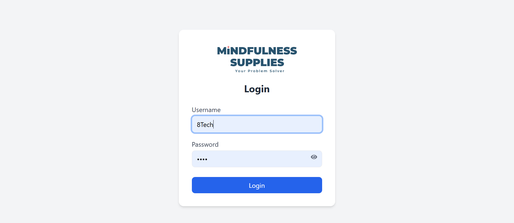
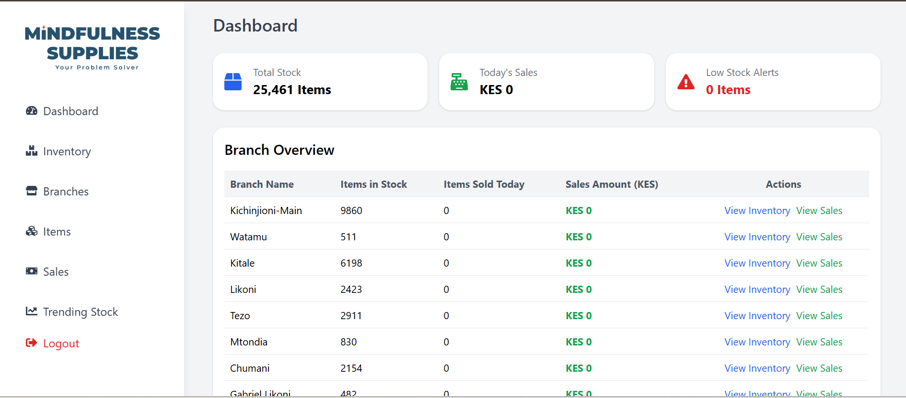
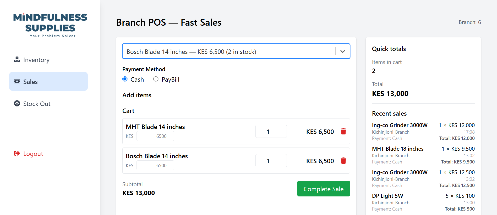
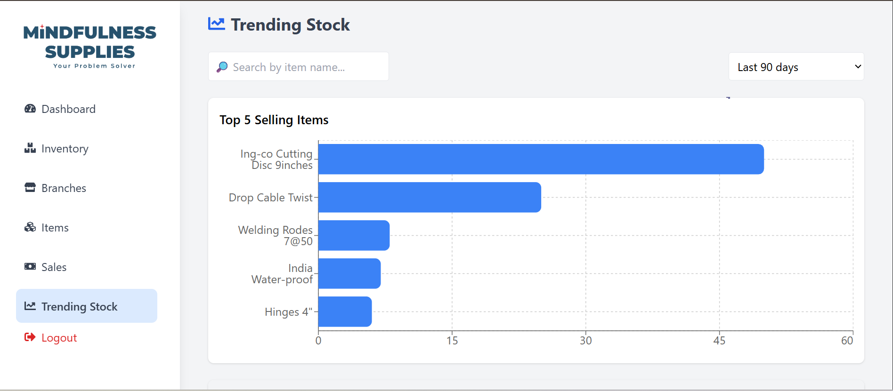
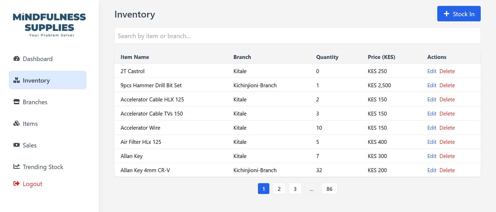
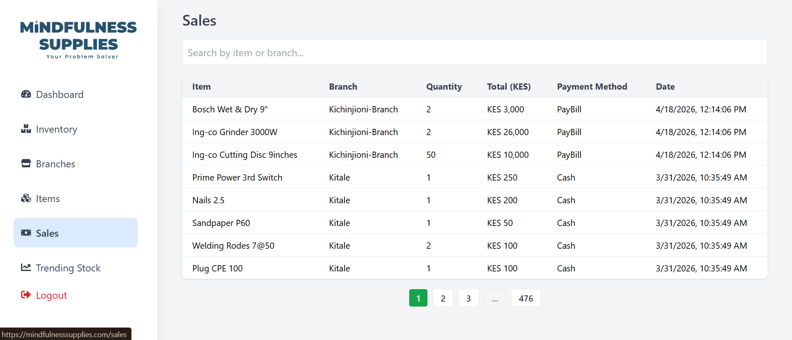

# Mindfulness Supplies Management System


## Table of Contents
- [Project Information](#project-information)
- [Why I Built This](#why-i-built-this)
- [Responsibilities](#responsibilities)
- [Overview](#overview)
- [Live Website](#live-website)
- [Project Highlights](#project-highlights)
- [Features](#features)
- [Tech Stack](#tech-stack)
- [System Architecture](#system-architecture)
- [Project Structure](#project-structure)
- [Installation](#installation)
- [Documentation](#documentation)
- [Challenges Solved](#challenges-solved)
- [Lessons Learned](#lessons-learned)
- [Impact](#impact)
- [Future Improvements](#future-improvements)
- [Screenshots](#screenshots)
- [License](#license)

## Project Information
**Client:** Mindfulness Supplies
**Role:** Full-Stack Software Engineer (Lead Developer)
**Duration:** 2025 – Present
**Status:** Production / Live
**Website:** https://mindfulnesssupplies.com

## Why I Built This
This project was developed to digitize inventory management and point-of-sale operations for Mindfulness Supplies. The goal was to replace fragmented manual workflows with a centralized platform that improves stock visibility, sales tracking, and operational efficiency across multiple branches.

## Responsibilities
- Designed and developed the React frontend for inventory, sales, and analytics workflows.
- Built the Django REST API backend to support branch-aware inventory, POS operations, and reporting.
- Developed stock management workflows for stock in, stock out, low-stock alerts, and branch-level transfers.
- Implemented sales transaction recording with payment methods, unit pricing, and totals validation.
- Designed authentication and role-based access for admin and branch users.
- Deployed and maintained the production system on PythonAnywhere and managed static assets.
- Diagnosed and resolved production issues across the backend API and React client.

## Overview
Mindfulness Supplies Management System is a web-based inventory and sales platform that enables the organization to manage products, branch inventory, stock movements, sales, and analytics from a centralized dashboard.

The system solves the business problem of fragmented stock tracking across branches and manual sales reporting by providing a single interface for branch operations, stock validation, and sales performance visibility.

## Live Website
🌐 **https://mindfulnesssupplies.com**

The platform is deployed and actively used for day-to-day inventory and sales management.

## Project Highlights
- Inventory Management
- Point of Sale (POS)
- Sales Dashboard
- Stock Analytics
- Branch Inventory
- Role-Based Access Control
- Production Deployment
- Responsive User Interface

## Repository Statistics
- Full-stack architecture
- Production deployment
- RESTful API
- Responsive web application
- Authentication & authorization
- Business analytics dashboard
- Multi-module inventory management

## Features
- User authentication and role-based access (admin and branch users)
- Dashboard with daily sales, stock totals, and low-stock alerts
- Inventory management by branch
- Branch stock transfers and stock in / stock out workflows
- Point of Sale (POS) transaction recording
- Sales history and reporting
- Trending stock and low stock monitoring
- Branch-specific inventory and pricing
- Search and filter inventory items
- Responsive UI for desktop and mobile views

## Tech Stack
### Frontend
- React
- Tailwind CSS
- Axios
- React Router
- Recharts

### Backend
- Python
- Django
- Django REST Framework
- Simple JWT
- django-cors-headers
- Whitenoise

### Database
- SQLite (Current)
- Designed for migration to PostgreSQL as the application scales

### Deployment
- PythonAnywhere

## System Architecture
```text
                Users
                  │
                  ▼
        React Frontend (SPA)
                  │
            Axios / HTTPS
                  │
                  ▼
     Django REST Framework API
                  │
          Business Logic Layer
                  │
                  ▼
          SQLite Database
```

## Project Structure
```text
mindfulness-supplies/
├── backend/
│   ├── inventory/
│   ├── inventory_app/
│   ├── manage.py
│   └── db.sqlite3
├── docs/
├── frontend/
│   ├── public/
│   ├── src/
│   └── package.json
├── screenshots/
├── LICENSE
└── README.md
```

## Installation
### Clone Repository
```bash
git clone https://github.com/HumphreyTuva/mindfulness-supplies.git
```

### Backend
```bash
cd backend
python -m venv venv
venv\Scripts\activate
pip install -r requirements.txt
python manage.py migrate
python manage.py runserver
```

### Frontend
```bash
cd frontend
npm install
npm start
```

> If `requirements.txt` is not present, install the backend dependencies manually with `pip install django djangorestframework djangorestframework-simplejwt django-cors-headers whitenoise`.

## Documentation
Additional technical documentation is available in the `docs/` directory.
- Architecture Design
- API Documentation
- Deployment Guide

## Acknowledgements
Developed for Mindfulness Supplies to improve inventory visibility, streamline point-of-sale operations, and centralize business reporting.

## Challenges Solved
- Real-time inventory updates across branches
- Preventing negative stock during transfers and sales
- Building a consistent sales reporting experience
- Implementing branch-aware access control
- Managing stock reallocation from a main branch to branch outlets

## Lessons Learned
- Designing inventory systems requires careful handling of branch-specific stock and pricing.
- Business software prioritizes reliability, validation, and role-based security.
- Dashboard analytics are more useful when powered by aggregated backend summaries.
- Production deployments require clear host configuration and CORS handling.

## Impact
The platform enables staff to:
- Manage inventory from a centralized system.
- Track branch-level stock movement in real time.
- Record and monitor sales through an integrated POS.
- Identify low-stock items before shortages occur.
- Reduce manual reconciliation and improve reporting accuracy.

## Future Improvements
- Add barcode scanning and faster checkout workflows
- Build purchase order and supplier management modules
- Add multi-branch financial analytics and consolidated reporting
- Implement automated low-stock notifications via email or SMS
- Create a dedicated mobile app for branch operators

## Screenshots
### Login


### Dashboard


### POS


### Trending Stock


### Inventory


### Sales / Reports


> Screenshot files are located in `screenshots/`.

## License
This project is released under the MIT License.
